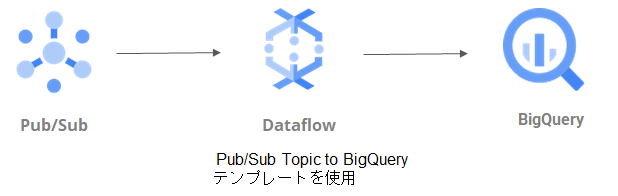
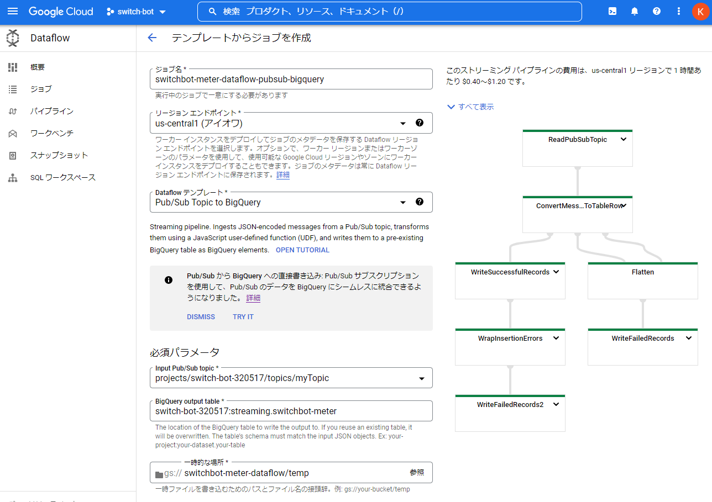

# switchbot-pubsub-topic-to-bigquery

## 概要

温度情報をPub/Subにpublishし、Dataflowによるストリーミング処理でBigQueryに挿入するパイプラインを作成する。

Dataflowは、Pub/Sub Topic to BigQueryテンプレートを使用する。

Pub/Sub Topic to BigQuery:

> Pub/Sub Topic to BigQuery テンプレートは、Pub/Sub トピックから JSON 形式のメッセージを読み取り、それらを BigQuery テーブルに書き込むストリーミング パイプラインです。このテンプレートは、Cloud Pub/Sub データを BigQuery に移動する簡単なソリューションとして使用できます。このテンプレートは Pub/Sub から JSON 形式のメッセージを読み込み、BigQuery 要素に変換します。

> このパイプラインの要件:
> 
> - Pub/Sub メッセージの data フィールドは、この JSON ガイドで説明されている JSON 形式を使用する必要があります。たとえば、data フィールドの値が {"k1":"v1", "k2":"v2"} としてフォーマットされたメッセージは、文字列データ型の k1 と k2 という 2 つの列を持つ BigQuery テーブルに挿入できます。
> - パイプラインの実行前に出力テーブルが存在している必要があります。テーブル スキーマが入力 JSON オブジェクトと一致する必要があります。

https://cloud.google.com/dataflow/docs/guides/templates/provided-streaming?hl=ja#cloudpubsubtobigquery  

## 構成図



## ストリーミング パイプラインの作成

### Pub/Subトピックの作成

```
$ gcloud pubsub topics create myTopic
```

### BigQueryテーブルの作成

データセットを作成。

```
$ bq mk --dataset --location=us streaming
```

テーブルを作成。

```
$ bq query --use_legacy_sql=false \
'CREATE TABLE `streaming.switchbot-meter`
(exec_time TIMESTAMP NOT NULL,
 device_name STRING NOT NULL,
 temperature FLOAT64 NOT NULL,
 humidity INT64 NOT NULL,
 dt DATE NOT NULL) PARTITION BY dt'
 ```

### Cloud Storageバケットの作成

```
$ gsutil mb -l US gs://switchbot-meter-dataflow/
```

Cloud StorageバケットはDataflowの一時ストレージとして使用される。

### Dataflowのジョブの作成

"Pub/Sub Topic to BigQuery"テンプレートを使用して、ストリーミングパイプラインを作成する。

Google Cloud コンソール → Dataflow → ジョブ → テンプレートからジョブを作成：



上の設定値と同等のコマンドライン。

```
$ gcloud dataflow jobs run switchbot-meter-dataflow-pubsub-bigquery --gcs-location gs://dataflow-templates-us-central1/latest/PubSub_to_BigQuery --region us-central1 --max-workers 1 --num-workers 1 --staging-location gs://switchbot-meter-dataflow/temp --parameters inputTopic=projects/switch-bot-320517/topics/myTopic,outputTableSpec=switch-bot-320517:streaming.switchbot-meter
```

## 動作確認

### Pub/Subトピックにメッセージを送信

温度情報をJSONフォーマットでPub/Subトピックに送信。

```
$ gcloud pubsub topics publish myTopic --message '{"exec_time":"2022-07-30 10:30:00", "device_name":"south_room", "temperature":28.0, "humidity":57, "dt":"2022-07-30"}'
```

### BigQueryのテーブルに挿入されたことを確認

```
$ bq query --use_legacy_sql=false 'SELECT * FROM `switch-bot-320517.streaming.switchbot-meter` WHERE dt = "2022-07-30"'
+---------------------+-------------+-------------+----------+------------+
|      exec_time      | device_name | temperature | humidity |     dt     |
+---------------------+-------------+-------------+----------+------------+
| 2022-07-30 10:30:00 | south_room  |        28.0 |       57 | 2022-07-30 |
+---------------------+-------------+-------------+----------+------------+
```

## ソースコードからDataflowのテンプレートを作成して実行

ビルド、実行方法は以下のREADME.mdを参照。  
https://github.com/GoogleCloudPlatform/DataflowTemplates

ソースコードを取得。

```
$ git clone https://github.com/GoogleCloudPlatform/DataflowTemplates.git
```

> Requirements
> - Java 8
> - Maven 3

Pub/Sub Topic to BigQueryのテンプレートファイルを作成。  

```
$ mvn compile exec:java \
-Dexec.mainClass=com.google.cloud.teleport.templates.PubSubToBigQuery \
-Dexec.cleanupDaemonThreads=false \
-Dexec.args=" \
--project=switch-bot-320517 \
--stagingLocation=gs://switchbot-meter-dataflow/staging \
--tempLocation=gs://switchbot-meter-dataflow/temp2 \
--templateLocation=gs://switchbot-meter-dataflow/templates/PubSubToBigQuery.json \
--runner=DataflowRunner \
--region=us-central1"
```

作成したテンプレートファイルを実行。

```
$ gcloud dataflow jobs run switchbot-meter-dataflow-pubsub-bigquery-2 \
--gcs-location=gs://switchbot-meter-dataflow/templates/PubSubToBigQuery.json \
--zone=us-central1-a \
--parameters \
"inputTopic=projects/switch-bot-320517/topics/myTopic,\
outputTableSpec=switch-bot-320517:streaming.switchbot-meter"
```

## 参考

Pub/SubからBigQueryへのストリーミング  
https://cloud.google.com/dataflow/docs/tutorials/dataflow-stream-to-bigquery?hl=ja

GCP Dataflow 公式チュートリアルを柔らかく煮込んでみた～Pub/Sub Topic to BigQuery～  
https://yuukou-exp.plus/gcp-dataflow-pub-sub-to-big-query/

Dataflowテンプレートのソースコード  
https://github.com/GoogleCloudPlatform/DataflowTemplates